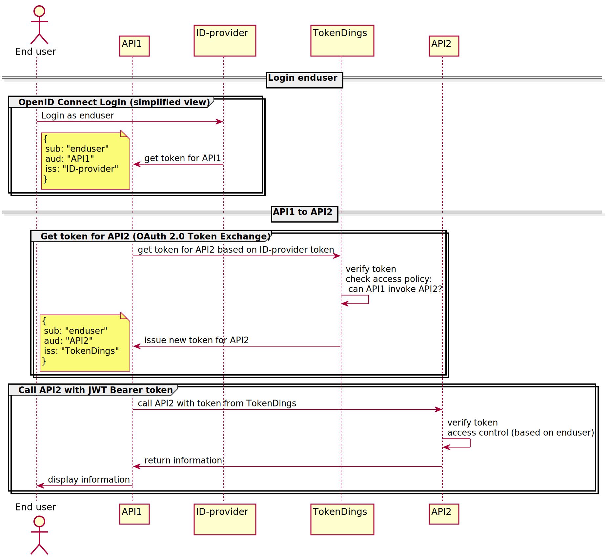

# TokenDings
> DISCLAIMER - WORK IN PROGRESS

Microservice implementing parts of the [OAuth 2.0 Token Exchange](https://www.rfc-editor.org/rfc/rfc8693.html) specification:

>This specification defines a protocol for an HTTP- and JSON-based Security Token Service (STS) by defining how to request and obtain security tokens from OAuth 2.0 authorization servers, including security tokens employing impersonation and delegation.

The application has been named **TokenDings** in order to avoid confusion with other "Security Token Services" (STS) currently deployed in our enviroment. 

In essence the motivation behind creating this application is based on the lack of offerings in the market implementing 
the functionality needed for "enduser" centric access control while using properly "scoped" OAuth 2.0 access_tokens (JWTs) in Web API chains.

This is best described by an example:
* End user log in to API1 (and get a token intended for API1)
* API1 will invoke a downstream api - API2 - to retrieve information
* API2 will enforce access control based on the enduser

In the above mentioned example API1 will have to invoke API2 on-behalf-of the enduser. 
When using OAuth 2.0 JWT Bearer tokens this entails getting a correctly scoped token 
(i.e intended for each "hop" in a downstream chain) while still keeping the authenticated end user as the subject. 



Other relevant specifications implemented:

* [OAuth 2.0 Authorization Server Metadata](https://www.rfc-editor.org/rfc/rfc8414.html): for configuring an app (OAuth2 Client) using TokenDings
* [OAuth 2.0 Dynamic Client Registration Protocol](https://tools.ietf.org/html/rfc7591): for registering apps (OAuth2 Clients) and access policies

## Usage

## Client Registration
 

## 👥 Contact

This project is currently maintained by the organisation [@navikt](https://github.com/navikt).

If you need to raise an issue or question about this library, please create an issue here and tag it with the appropriate label.

If you need to contact anyone directly, please see contributors.

## ✏️ Contributing

To get started, please fork the repo and checkout a new branch. You can then build the library locally with the Gradle wrapper

```shell script
./gradlew build
```

See more info in [CONTRIBUTING.md](CONTRIBUTING.md)

## ⚖️ License
This library is licensed under the [MIT License](LICENSE)
